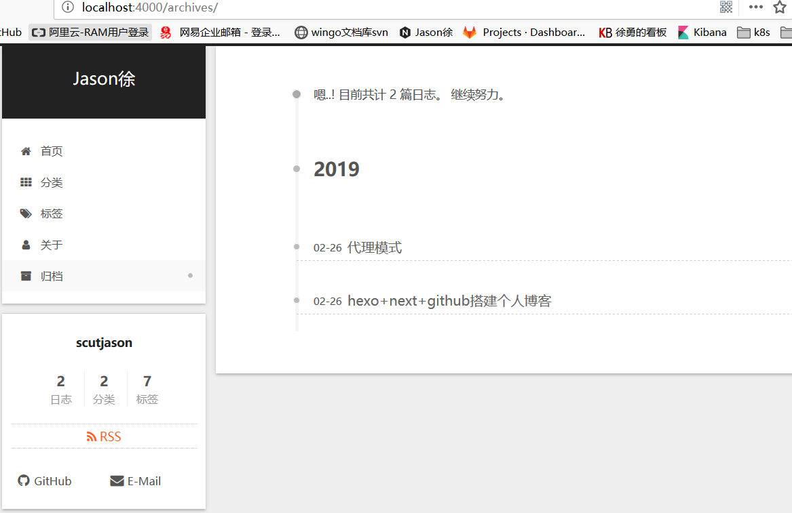

本文介绍搭建如何通过github + hexo + next搭建个人网站。

1、选择网站服务器
  服务器购买有以下几种方式，云服务器、github pages等。购买云服务器代价有点大，后端和前端都要自己动手，比较麻烦，当然有些同志不怕麻烦可以选择这种方式，对于我这种只想写点自己的技术博客以及总结的人来说，用github pages足以。github pages的搭建方式非常简单，参考官网https://pages.github.com/
<!--more-->
2、安装hexo
  hexo一款基于Node.js的静态博客框架，生成静态网页非常方便，网页可以无缝托管在github上。
  2.1 安装Node.js
    直接去官网安装即可 https://nodejs.org/en/download/
  2.2 安装hexo
  ```
    npm install -g hexo-cli
  ```
  本地新建一个blog的文件夹，执行cmd命令
  ```
    hexo init blog
    cd blog
    npm install
    hexo g  (generate) # 生成静态网页文件
    hexo s  (server)  # 启动hexo服务
  ```
  浏览器打开 localhost:4000 就能看到博客的框架网站建好了。

3、github + hexo
  将第1步的github Pages地址添加到blog目录下的_config.yml中，具体位置如下
  ```
    deploy:
      type: git
      repo: https://github.com/yourName/yourName.github.io
      branch: master
  ```
    执行命令
  ```
    hexo clean
    hexo g
    hexo d (deploy) # 部署，这一步要输入github的账号和密码
  ```
    这样hexo就自动跟github连在一起了，本地修改静态网页，通过hexo d推送到你的github pages
    服务器，打开github网页就能访问你的博客了。
4、hexo的基本配置
  hexo的配置文件在blog目录下的_config.yml中，主要包括网站的一些基本信息，配置不难，打开看一下就大概清楚了
  4.1 如何添加博客
  ```
    hexo new newPost
  ```
   在blog/source/_ posts目录下看到newPost文件夹，同时在该文件夹下有一个newPost.md文件，这个文md件就是静态博客文件拉。

5、next主题配置
  hexo有N多种主题，不过蛮多人喜欢简洁的next。下面就来看下怎么添加这个主题
  首先下载这个next主题 https://github.com/iissnan/hexo-theme-next/releases
  将其解压到blog的themes目录，目录名字改为next，然后将blog目录下的_config.yml文件配置改一下。

  theme: next

  注意在这个themes/next目录下也有个_config.yml文件，这个文件里面有网站的一些更详细的配置。比如菜单、网站流量等
  5.1 如何添加一个菜单呢?
  ```
    hexo new page tags # 比如我想添加一个tags的菜单项
  ```
  注意: 这个命令里面多了一个page，与前一个命名的不同在于，这个page是页面上的另一页，对应的文件路径是 source/tags
  不加page 选项默认是新建post，post可以理解为是博客，而page是与菜单项
  5.2 如何给post博客添加tag标签和目录呢？
  ```
    hexo new page categories
  ```
  在source目录下生成一个categories目录，该目录下有个index.md的文件，打开该文件添加

  title:
  date: 2019-02-26 14:48:06
  type: categories

  同理在tags目录下的index.md文件中添加

  title:
  date: 2019-02-26 14:46:53
  type: tags

  注意添加完菜单后还是要在themes/next目录下的_config.yml文件中配置一下
  ```
  menu:
    home: / || home
    categories: /categories/ || th
    tags: /tags/ || tags
  ```
  本地调试一下，看有没有生效。
  ```
  hexo clean
  hexo g
  hexo s
  ```
  见下图
  
