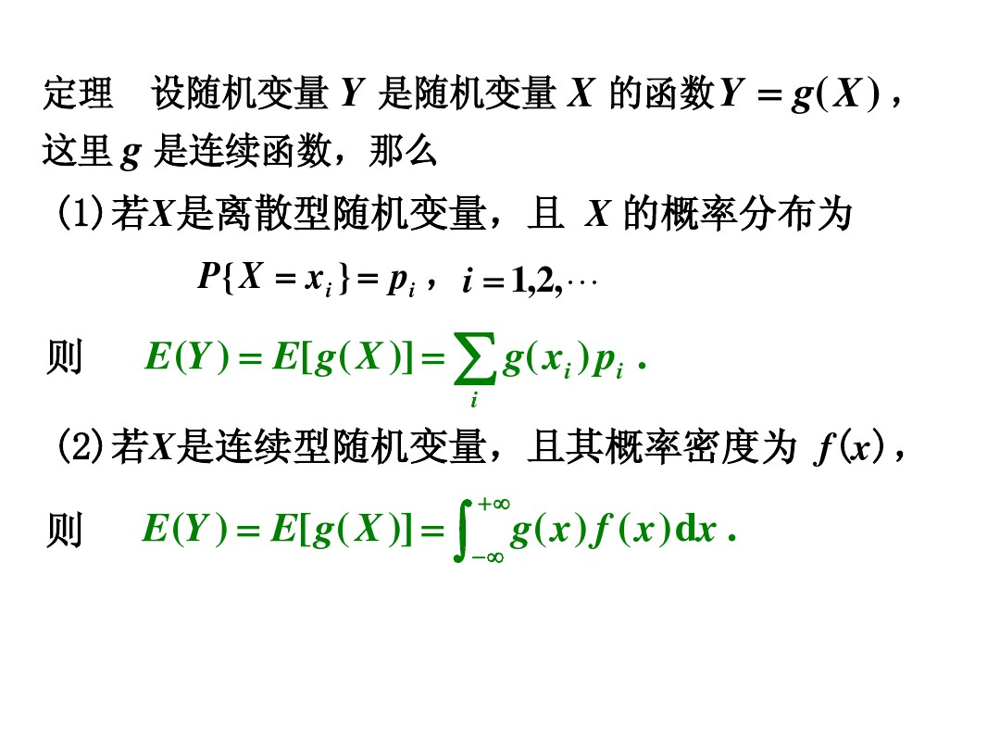
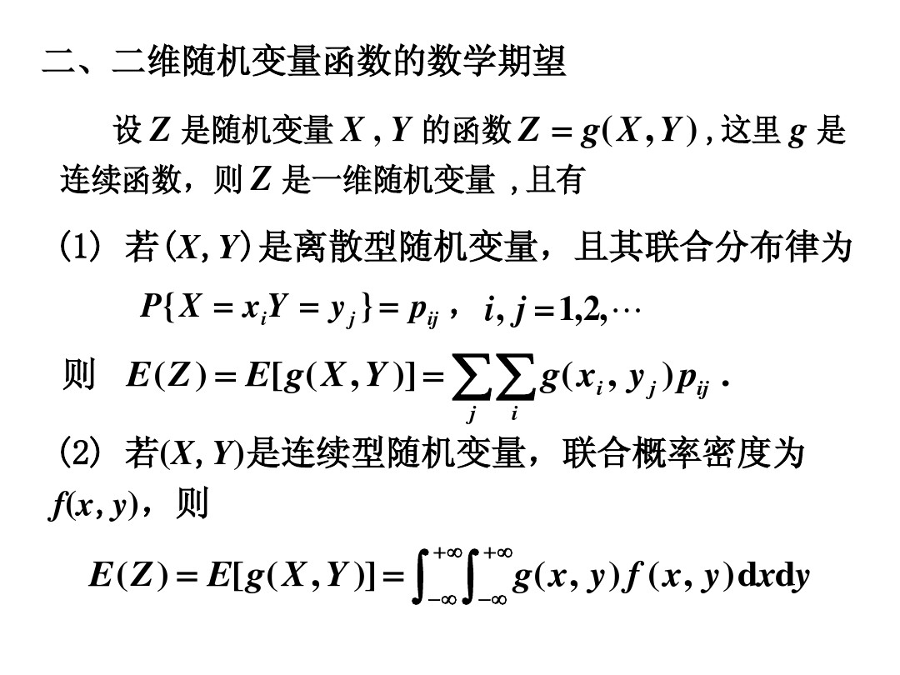

本文介绍机器学习里常用的数据概念之一  期望
<!--more-->
# 期望的概念
在概率论和统计学中，期望(也称均值）是随机试验中中每次可能结果的概率乘以其结果的总和，是最基本的数学特征之一。
  它反映随机变量平均取值的大小。

# 期望的表达式
$E(x)$，$x$表示随机变量

# 期望的性质
$E(C)=C$，$C$为常数；
$E(CX)=CE(X)$，$C$为常数；
$E(X+Y)=E(X)+E(Y)$
$E(XY)=E(X)E(Y)$，当$X$和$Y$相互独立时；

# 离散随机变量的期望
$E(x)=\sum_{i=1}^∞x_ip_i $
$x_i$ 表示随机变量$x$的在第$i$次出现的值，$p_i$ 表示对应的概率。

# 连续随机变量的期望
设连续型随机变量的概率密度函数为$f(x)$，则其期望为
$E(x)=\int^∞xf(x)dx$

# 随机变量函数的期望
若随机变量$Y=g(x)$，那么
$E(Y)=E(g(x))=\int^∞g(x)f(x)dx$
上面$f(x)$是随机变量$x$的概率密度函数。

如果是二维随机变量呢？ $Z=g(X,Y)$，g是连续函数，$Z$是一维随机变量，
$E(Z)=E(g(X,Y))=\int^∞\int^∞g(x,y)f(x,y)dxdy$
$f(x,y)$是$(X,Y)$的联合概率密度。

# 条件概率的期望
## 概念
首先介绍一下条件概率，假设事件A发生的条件下，事件B发生的概率，记为$P(B|A)$。
$P(B|A)=\frac{P(AB)}{P(A)}$
$P(A)>0$，事件A发生的概率；
$P(AB)$，事件A和事件B同时发生的概率；

## 条件概率密度
对于二维随机变量$(X,Y)$的概率密度$f(x,y)$，关于y的边缘概率密度为$f_Y(y)$。那么关于$Y=y$的条件概率密度为
$f_{X|Y}(x|y)=\frac{f(x,y)}{f_Y(y)}$
其中：
$f(x,y)$为$(X,Y)$联合概率密度
$f_Y(y)=\int_{-∞}^∞f(x,y)dx$
## 条件分布
$F(x|y)=P\left\{X≤x|Y=y\right\}=\int_{-∞}^xf(x|y)dx=\int_{-∞}^x\frac{f(u,y)}{f_Y(y)}du$ 为$Y=y$的条件下，$X$的条件分布函数，
本质来说就是固定y，对x求积分，得到x的概率值。
同理
$F(y|x)=P\left\{Y≤y|X=x\right\}=\int_{-∞}^yf(y|x)dy=\int_{-∞}^y\frac{f(x,v)}{f_X(x)}dv$ 为$X=x$的条件下，$Y$的条件分布函数，
固定x，对y求积分，得到y的概率值。

$f(x,y)=f_Y(y).f(x|y)=f_X(x).f(y|x)$，联合概率密度=边缘分布密度*条件概率密度
## 条件期望
上面的条件概率事件的期望怎么求呢？
$E(X|Y=y)=\left\{
\begin{aligned}
&\sum\limits_{i}x_iP(X=x_i|Y=y)  \qquad 离散型随机变量 \\
&\int_{-∞}^∞xf_{X|Y}(x|y)dx \qquad\qquad连续型随机变量\\  
\end{aligned}
\right.
$
注意，$E(X|Y=y)$是关于随机变量$y$的函数，记为$g(y)=E(X|Y=y)$，我们称之为在给定$Y$的条件下$X$的条件期望。
条件期望是条件分布的数学期望。
$E(g(X)Y|X)=g(X)E(Y|X)$
$E(g(X)X)=g(X)E(X)$
## 重期望公式
$E(X)=E(E(X|Y))$
证明：
$
\begin{aligned}
E(X)=\int_{-∞}^∞xf_X(x)dx
&=\int_{-∞}^∞\int_{-∞}^∞xf(x,y)dydx \\
&=\int_{-∞}^∞\int_{-∞}^∞xf_Y(y)f(x|y)dydx \\
&=\int_{-∞}^∞ \int_{-∞}^∞xf(x|y)dy f_Y(y)dx \qquad根据条件期望\int_{-∞}^∞xf(x|y)dy=E(X|Y=y)\\
&=\int_{-∞}^∞E(X|Y=y)f_Y(y)dx \\
&=\int_{-∞}^∞g(y)f_Y(y)dx \qquad 根据前面可知，g(y) = E(X|Y=y)\\
&=E(g(Y)) \qquad g(y)函数的期望，g(y)概率密度对应的分布为 g(Y)=E(X|Y) \\
&=E(E(X|Y)) \qquad \\
\end{aligned}
$
这个重期望公式的具体表现为：
$Y$是离散型
$E(X)=\sum\limits_{j}p(Y=y_j)E(X|Y=y_j)$
$Y$是连续型
$E(X)=\int_{-∞}^∞f_Y(y)E(X|Y=y)dy$

重期望公式有啥用呢？我们知道当求某个随机变量$X$的期望$E(X)$时，如果$X$的取值范围很大，
那我们只好寻找相关的变量$Y$，$Y$的不同取值将这个大范围分成若干小区域，先在小区域上求$X$
的期望，在统一进行加权期望，这样就得到了$E(X)$。本质来说就是先局部平均，再整体平均。

比如说我们要求整个年级的平均分，有两种思路
1、直接求每个人的分数和除以总人数，这是$E(X)$，求整体平均
2、我们先求每个班级的平均分，然后把每个班级的平均分相加除以班级数一样可以得到整个年级的平均分，这是$E(E(X|Y))$
  $Y$表示每个班级，计算每个班级的平均分相当于固定一个$Y=y$去求#E(X|Y=y)#，最后再对班级做平均得到结果。这是局部平均
