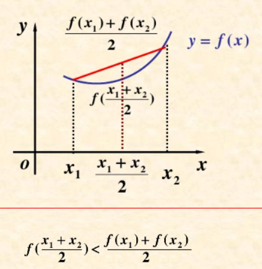

本文介绍机器学习里常用的不等式 琴生不等式
<!--more-->
#凸函数
设函数$f(X)$在区间上的定义，对于任意的两点$x_1$，$x_2$和任意的$λ∈(0,1)$，都存在
$f(λx_1+(1-λ)x_2)<=λf(x_1)+(1-λ)f(x_2)$
注意这里的凸函数是机器学习领域里的定义，可能跟高数里面的凸函数定义是反的。

#琴生不等式
函数$f(X)$在区间$[a,b]$上为凸，在该区间上取值$x_1,x_2,x_3,...,x_n$，那么有
$f(\frac{x_1+x_2+...+x_n}{n})≥\frac{f(x_1)+f(x_2)+...+f(x_n)}{n}$
若:  $a_1+a_2+...+a_n=1$
$f(a_1x_1+a_2x_2+...+a_nx_n)≥a_1f(x_1)+a_2f(x_2)+...+a_nf(a_n)$

##证明
用归纳法证明如下：
当$n=1$时，不等式$f(x_1)=f(x_1)$ 成立

当$n=2$时，不等式$f(a_1x_1+a_2x_2)≥a_1f(x_1)+a_2f(x_2)$
连接$f(x)$上的两点$(x_1,y_1)$和$(x_2,y_2)$，构建一条直线$g(x)=kx+b$
这条直线永远在曲线$f(x)$下方。$f(a_1x_1+a_2x_2)≥g(a_1x_1+a_2x_2)$
而 $g(a_1x_1+a_2x_2)=a_1g(x_1)+a_2g(x_2)=a_1f(x_1)+a_2f(x_2) \qquad 因为这两点也在f(x)上$
因此$n=2也成立$

当$n≥2$时不等式成立，当$n=n+1$时，不等式为
$
\begin{aligned}
&a_1f(x_1)+a_2f(x_2)+...+a_{n+1}f(x_{n+1})=\\
&(1-a_{n+1})[\frac{a_1}{1-a_{n+1}}f(x_1)+\frac{a_2}{1-a_{n+1}}f(x_2)+...+\frac{a_n}{1-a_{n+1}}f(x_n)]+a_{n+1}f(x_{n+1})\\
&注意a_1+a_2+...+a_{n+1}=1\\
&≤(1-a_{n+1})f(\frac{a_1}{1-a_{n+1}}x_1+\frac{a_2}{1-a_{n+1}}x_2+...+\frac{a_n}{1-a_{n+1}}x_n)+a_{n+1}f(x_{n+1}) \qquad把两项合并\\
&≤f(a_1x_1)+a_2x_2+...+a_{n+1}x_{n+1})
\end{aligned}
$

##应用
琴生不等式在最大熵模型中有很好的应用。
设$p(X), q(X)$是在X中取值的两个概率分布，给定如下公式
$D(p||q)=\sum\limits_xp(x)log\frac{p(x)}{q(x)}=E_{p(x)}log\frac{q(x)}{q(x)}$
$D(p||q)$ 就是$p$分布与$q$分布的距离（相对熵）
证明: $D(p||q)≥0$
$
\begin{aligned}
&D(p||q)\\
&=\sum\limits_xp(x)log\frac{p(x)}{q(x)}\\
&=-\sum\limits_xp(x)log\frac{q(x)}{p(x)}\\
&注意 \sum\limits_xp(x)=1, log(x)是凹函数, 把p(x)放进去\\
&≥-log\sum\limits_x(p(x)\frac{q(x)}{p(x)})\\
&=-log\sum\limits_xq(x)=log(1)=0
\end{aligned}
$
